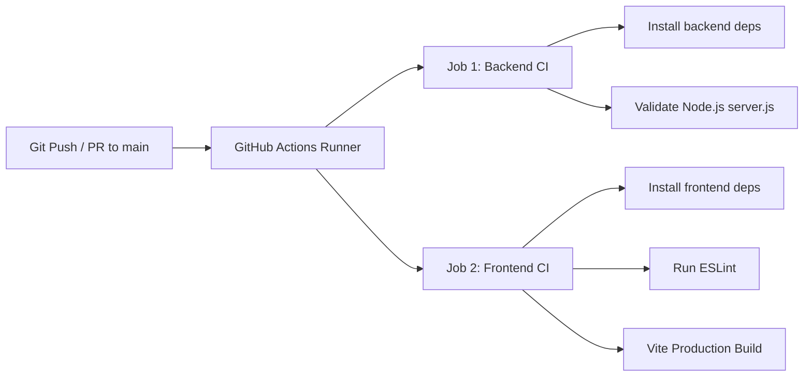

# Second Brain - Git Workflow & CI/CD Guidelines

This document outlines the standard Git workflow, branching strategy, commit conventions, code review process, and automated CI/CD pipeline for the **Second Brain** project.

---

## 1. Branching Strategy

Second Brain follows a structured feature-branch workflow built around a stable `main` branch.

```
       feat/learning-diagnosis
          o---o---o
         /         \  (Pull Request & CI checks)
--o-----o-----------o------------------------> main (Production)
   \               /
    o-------------o
       fix/ocr-upload-bug
```

### Branch Types & Naming Conventions

- **`main`**: Production-ready branch. Automatically deployed to:
  - **Frontend**: Vercel (`https://secondbrain-frontend-eight.vercel.app`)
  - **Backend**: Render (`https://secondbrain-pi02.onrender.com`)
- **`feature/<feature-description>`**: New features or enhancements.
  - *Example*: `feature/learning-diagnosis-ui`, `feature/vector-embeddings`
- **`fix/<bug-description>`**: Bug fixes and patch resolutions.
  - *Example*: `fix/ocr-parsing-timeout`, `fix/chat-scroll-jump`
- **`refactor/<scope-description>`**: Code restructuring without external behavior changes.
  - *Example*: `refactor/openrouter-client`, `refactor/note-controller`
- **`docs/<doc-description>`**: Documentation updates, PRD, LLD, or diagram updates.
  - *Example*: `docs/api-routes-update`, `docs/readme-badges`
- **`chore/<task-description>`**: Maintenance, dependency updates, build configurations.
  - *Example*: `chore/update-dependencies`, `chore/eslint-config`

---

## 2. Commit Message Standards

All commits must adhere to Conventional Commits guidelines to ensure clear history and automated changelog compatibility.

### Format

```text
<type>(<scope>): <short summary in imperative present tense>

[optional body providing details of what and why]

[optional footer(s), e.g., Fixes #123]
```

### Types

| Type | Description | Example |
| :--- | :--- | :--- |
| **`feat`** | A new feature | `feat(backend): implement cross-note learning diagnosis` |
| **`fix`** | A bug fix | `fix(frontend): resolve ReactFlow node selection reset` |
| **`docs`** | Documentation changes | `docs(root): add comprehensive Git workflow file` |
| **`style`** | Code formatting, missing semi-colons | `style(frontend): format NoteCard component styling` |
| **`refactor`** | Code refactoring without logic change | `refactor(backend): modularize retrieval service` |
| **`test`** | Adding or updating tests | `test(backend): add unit test for OCR service` |
| **`chore`** | Maintenance, dependencies, config | `chore(root): update .gitignore for temporary assets` |
| **`ci`** | CI/CD workflow configuration changes | `ci(github): add GitHub Actions workflow for backend & frontend` |

---

## 3. Ignored Assets & Secrets Safety

Security and clean repository management are enforced via `.gitignore`. The following patterns MUST remain ignored at all times:

- **Environment Variables**: `.env`, `.env.local`
- **Dependencies**: `node_modules/`
- **Build Artifacts**: `dist/`, `build/`, `*.log`
- **Temporary Uploads**: `backend/uploads/*` (except `.gitkeep` / placeholder)
- **OS / IDE Files**: `.DS_Store`, `.vscode/`, `.idea/`

> **Note**: Never commit API keys (`OPENROUTER_API_KEY`, `MONGODB_URI`) into Git history.

---

## 4. Pull Request & Code Review Workflow

1. **Create a Feature Branch**:
   ```bash
   git checkout main
   git pull origin main
   git checkout -b feature/your-feature-name
   ```

2. **Commit Changes Atomically**:
   ```bash
   git add .
   git commit -m "feat(scope): descriptive message"
   ```

3. **Push Branch to Remote**:
   ```bash
   git push -u origin feature/your-feature-name
   ```

4. **Open a Pull Request (PR)**:
   - Target branch: `main`
   - PR Title: Follow commit naming rules (e.g., `feat(ui): add learning diagnosis roadmap`).
   - Include a summary of changes, screenshot/screen recording (if UI changes), and verification steps.

5. **Automated CI Validation**:
   - GitHub Actions runs syntax checks, linting (`npm run lint`), and builds (`npm run build`).
   - All CI checks must pass before merging.

6. **Merge Strategy**:
   - Use **Squash and Merge** for feature branches to keep `main` history clean and linear.

---

## 5. Automated CI/CD Workflow (GitHub Actions)

The repository uses GitHub Actions (`.github/workflows/ci.yml`) to automatically build and validate both the Express backend and React/Vite frontend on every push and pull request.

### Pipeline Stages



---

## 6. Release & Deployment Checklist

- [ ] All feature PRs merged into `main`.
- [ ] Backend passes `node --check server.js`.
- [ ] Frontend passes `npm run lint` and `npm run build`.
- [ ] Environment variables configured on Render and Vercel dashboards.
- [ ] Live application verified on staging/production links.
