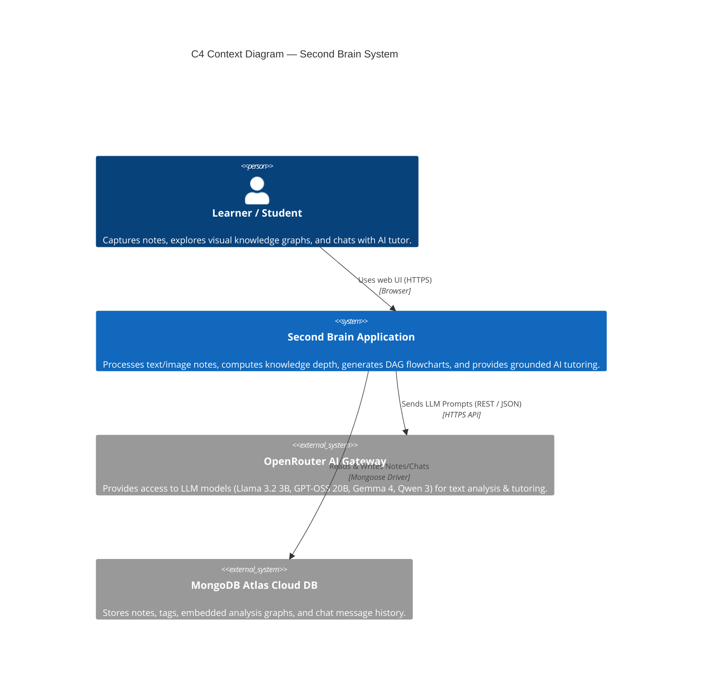
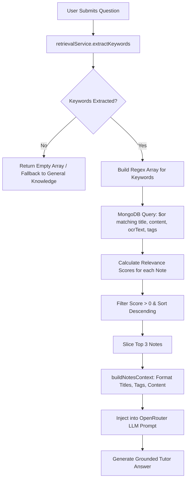
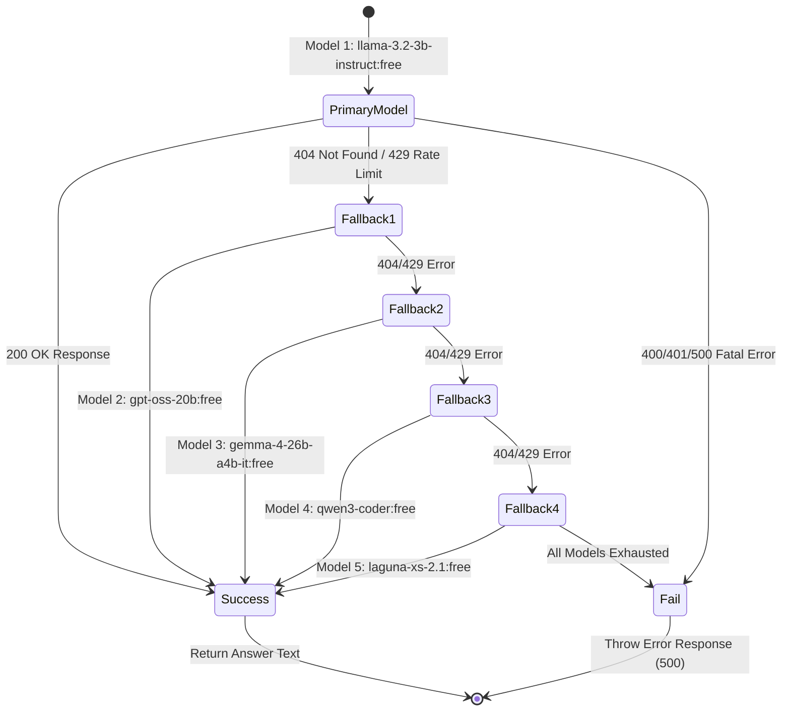
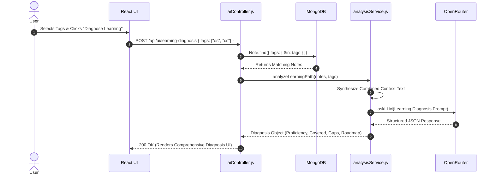

# High Level Design (HLD) — Second Brain

## 1. System Architecture Overview

### 1.1 Architectural Style
Second Brain is built as a **Decoupled Multi-Tier Client-Server Architecture**:
- **Single Page Application (SPA) Frontend**: Built with React 18 and Vite, responsible for UI state management, interactive flowchart rendering (ReactFlow), markdown display, and API communication.
- **RESTful API Gateway / Backend**: Built with Node.js and Express, handling endpoint routing, file uploads, OCR processing, RAG keyword scoring, and LLM orchestration.
- **Document Store Database**: MongoDB Atlas (managed cloud service) storing structured notes, embedded knowledge analysis, and chat thread histories via Mongoose ORM.
- **External AI Infrastructure**: OpenRouter API acting as a multi-model LLM gateway with automated failover handling.



---

## 2. Container Architecture

```mermaid
C4Container
    title C4 Container Diagram — Second Brain Subsystems

    Container(spa, "React SPA Frontend", "React 18, Vite, ReactFlow, CSS3", "Renders UI, manages active tab state, handles note detail modals and interactive DAG node click bridges.")
    
    SystemBound(backend, "Express Node Backend Server") {
        Container(api, "Express API Router", "Node.js / Express", "Exposes REST endpoints for /notes, /api/ai, and /api/chat.")
        Container(ocr, "OCR Engine", "Tesseract.js", "Extracts optical text from uploaded image files.")
        Container(rag, "RAG Retrieval Service", "JavaScript", "Tokenizes queries, filters stop-words, and scores note relevance.")
        Container(analyzer, "Analysis Engine", "JavaScript / OpenRouter", "Runs per-note knowledge assessment and cross-note learning diagnosis.")
        Container(ai_client, "OpenRouter AI Client", "Axios", "Handles API retries and model fallback chains.")
    }

    ContainerDb(db, "MongoDB Database", "MongoDB / Mongoose", "Collections: 'notes' (with embedded analysis) and 'chats'.")
    Container(uploads, "Local Disk Uploads", "File System", "Stores static uploaded images served at /uploads.")

    Rel(spa, api, "HTTP Requests (JSON / FormData)", "Axios / Fetch")
    Rel(api, uploads, "Saves / Deletes Image Files", "fs module")
    Rel(api, ocr, "Invokes OCR Extraction", "In-Process Thread")
    Rel(api, db, "Query & Update Operations", "Mongoose")
    Rel(analyzer, ai_client, "Sends Analysis Prompts", "JS Function Call")
    Rel(rag, db, "Fetches Candidate Notes", "Mongoose find()")
    Rel(ai_client, openrouter, "POST /chat/completions", "HTTPS Bearer Auth")
```

---

## 3. Subsystem Breakdown & Layered Architecture

```mermaid
graph TD
    subgraph Presentation Tier (Frontend)
        App[App.jsx - Shell & Tab Routing]
        Home[Home.jsx - Notes Dashboard]
        ChatP[ChatPage.jsx - Chat Interface]
        KA[KnowledgeAnalysis.jsx - ReactFlow DAG & Score]
        ND[NoteDetail.jsx - Markdown View & AI Drafts]
        AN[AddNote.jsx - Text/Image Creator]
        API_FE[services/api.js - HTTP Client]
    end

    subgraph API Gateway & Routing Tier
        Server[server.js - Express Config & Static Middleware]
        NR[routes/noteRoutes.js]
        AR[routes/aiRoute.js]
        CR[routes/chatRoutes.js]
        Multer[middleware/upload.js - Disk Storage]
    end

    subgraph Controllers Tier
        NC[noteController.js]
        AC[aiController.js]
        CC[chatController.js]
    end

    subgraph Core Services Subsystem
        OCRS[ocrService.js - Tesseract.js]
        RS[retrievalService.js - RAG Keyword Scorer]
        ANS[analysisService.js - Per-Note & Path Diagnosis]
        AIS[aiService.js - OpenRouter Resilience Client]
    end

    subgraph Persistence Tier
        NM[models/Note.js - Mongoose Schema]
        CM[models/Chat.js - Mongoose Schema]
        FS[(Disk Storage: /uploads)]
        MDB[(MongoDB Atlas)]
    end

    App --> Home
    App --> ChatP
    Home --> KA
    Home --> ND
    Home --> AN
    Home --> API_FE
    ChatP --> API_FE
    
    API_FE --> Server
    Server --> NR
    Server --> AR
    Server --> CR
    NR --> Multer

    NR --> NC
    AR --> AC
    CR --> CC

    NC --> OCRS
    NC --> ANS
    NC --> NM
    NC --> CM
    NC --> FS

    AC --> RS
    AC --> AIS
    AC --> ANS
    AC --> NM

    CC --> AIS
    CC --> RS
    CC --> CM
    CC --> NM

    NM --> MDB
    CM --> MDB
```

---

## 4. Key Subsystem Specifications & Workflows

### 4.1 Note Ingestion & Non-Blocking Async Analysis Subsystem
When a user submits a note:
1. **Immediate Write Phase**: Text is sanitized; if an image is provided, `ocrService.js` processes it using Tesseract.js. The note is immediately committed to MongoDB and returned to the client ($<300\text{ ms}$).
2. **Background Execution Phase**: `setImmediate()` delegates execution to `analysisService.analyzeNote()`. The LLM evaluates the text and returns a structured JSON payload containing a 0–100 score, level taxonomy, strengths/gaps, and 5–8 DAG flowchart nodes.
3. **Database Patch Phase**: The result is saved directly into `note.analysis` via `findByIdAndUpdate()`.

```mermaid
sequenceDiagram
    autonumber
    actor Client
    participant NoteCtrl as noteController.js
    participant OCR as ocrService.js
    participant DB as MongoDB
    participant EventLoop as Node.js Event Loop
    participant Analysis as analysisService.js
    participant LLM as OpenRouter AI

    Client->>NoteCtrl: POST /notes/upload (Form Data)
    NoteCtrl->>OCR: extractTextFromImage(file.path)
    OCR-->>NoteCtrl: { text, blocks, confidence }
    NoteCtrl->>DB: note.save()
    DB-->>NoteCtrl: savedNote
    NoteCtrl-->>Client: 201 Created (Return savedNote)
    
    NoteCtrl->>EventLoop: setImmediate(runAnalysisAsync)
    deactivate NoteCtrl

    EventLoop->>Analysis: analyzeNote(savedNote)
    Analysis->>LLM: askLLM(Assessment Prompt)
    LLM-->>Analysis: JSON { score, level, summary, nodes }
    Analysis-->>EventLoop: Parsed Analysis Object
    EventLoop->>DB: Note.findByIdAndUpdate(noteId, { analysis })
```

---

### 4.2 RAG Keyword Retrieval & Grounded Chat Subsystem
When answering user questions in global mode or searching notes:
1. **Normalization & Stop-Word Filtering**: The input query is stripped of non-alphanumeric characters, converted to lowercase, and split into tokens. Tokens matching a standard stop-word dictionary (e.g., *what, is, the, for, explain*) or having length $\le 2$ are excluded.
2. **Regex Query & Relevance Scoring**: MongoDB retrieves candidate notes containing any keyword token across `title`, `content`, `ocrText`, or `tags`.
3. **Weighted Scoring Matrix**:
   $$\text{Score} = \sum_{k \in \text{Keywords}} \left( 3 \times \mathbb{I}(k \in \text{Title}) + 3 \times \mathbb{I}(k \in \text{Tags}) + 2 \times \mathbb{I}(k \in \text{Content}) + 2 \times \mathbb{I}(k \in \text{OCR}) \right)$$
4. **Top-3 Slice & Prompt Injection**: Notes are sorted in descending order of score, filtered ($\text{Score} > 0$), and capped at top 3. Their structured content is concatenated into the LLM system prompt.



---

### 4.3 Resilience & OpenRouter Multi-Model Fallback Chain
To ensure maximum availability on OpenRouter's free tier, calls to `askLLM()` execute an automated retry loop over a prioritized list of models:



---

### 4.4 Learning Diagnosis Subsystem (Cross-Note Analysis)
The Learning Diagnosis Engine provides a macro-level review across multiple notes matching specific tag inputs:



---

## 5. Deployment & Physical Network Architecture

The application is deployed across cloud infrastructure optimized for performance and free-tier compatibility:

```mermaid
graph LR
    subgraph Client Browser
        Browser[User Browser]
    end

    subgraph Vercel CDN (Frontend Host)
        Vercel[Vercel Edge Network<br/>Static SPA Hosting<br/>VITE_API_BASE_URL]
    end

    subgraph Render Platform (Backend Host)
        Render[Render Web Service<br/>Node.js runtime<br/>Port 3000<br/>Disk Storage: /uploads]
    end

    subgraph External Cloud Services
        Atlas[(MongoDB Atlas Cloud DB<br/>TLS Connection String)]
        OpenRouterAPI[OpenRouter.ai Cloud Gateway<br/>HTTPS API]
    end

    Browser -->|1. Fetch Static HTML/JS| Vercel
    Browser -->|2. REST API Requests| Render
    Render -->|3. Read/Write Data| Atlas
    Render -->|4. LLM API Calls| OpenRouterAPI
```
