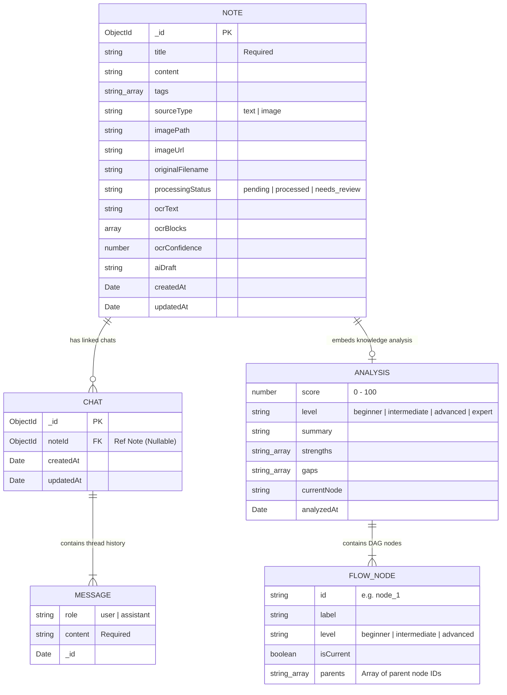
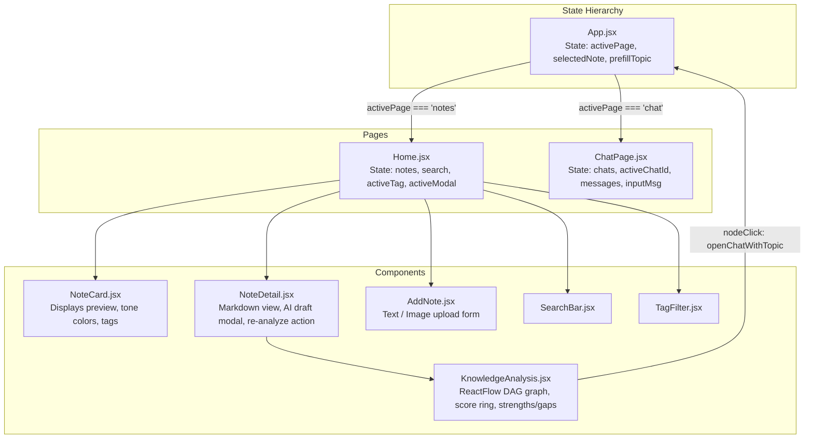

# Low Level Design (LLD) — Second Brain

## 1. Database Schema & Data Models

Second Brain uses MongoDB Atlas as its primary persistence layer. Mongoose schemas strictly define document structures, data types, enum validations, embedded sub-documents, and relationship references.



### 1.1 Mongoose Model Definitions

#### Note Schema (`backend/models/Note.js`)
```javascript
const flowNodeSchema = new mongoose.Schema({
  id:        { type: String, required: true },
  label:     { type: String, required: true },
  level:     { type: String, enum: ['beginner', 'intermediate', 'advanced'], default: 'beginner' },
  isCurrent: { type: Boolean, default: false },
  parents:   [String],
}, { _id: false });

const analysisSchema = new mongoose.Schema({
  score:       { type: Number, min: 0, max: 100, default: null },
  level:       { type: String, enum: ['beginner', 'intermediate', 'advanced', 'expert'], default: null },
  summary:     { type: String, default: '' },
  strengths:   [String],
  gaps:        [String],
  currentNode: { type: String, default: '' },
  nodes:       [flowNodeSchema],
  analyzedAt:  { type: Date, default: null },
}, { _id: false });

const noteSchema = new mongoose.Schema({
  title:            { type: String, required: true },
  content:          { type: String, default: '' },
  tags:             [String],
  sourceType:       { type: String, enum: ['text', 'image'], default: 'text' },
  imagePath:        { type: String, default: '' },
  imageUrl:         { type: String, default: '' },
  originalFilename: { type: String, default: '' },
  processingStatus: { type: String, enum: ['pending', 'processed', 'needs_review'], default: 'processed' },
  ocrText:          { type: String, default: '' },
  ocrBlocks:        { type: Array, default: [] },
  ocrConfidence:    { type: Number, default: null },
  aiDraft:          { type: String, default: '' },
  analysis:         { type: analysisSchema, default: null },
}, { timestamps: true });
```

#### Chat Schema (`backend/models/Chat.js`)
```javascript
const chatSchema = new mongoose.Schema({
  noteId: {
    type: mongoose.Schema.Types.ObjectId,
    ref: "Note",
    default: null,
  },
  messages: [
    {
      role:    { type: String, enum: ["user", "assistant"], required: true },
      content: { type: String, required: true },
    },
  ],
}, { timestamps: true });
```

---

## 2. API Endpoint Specifications

### 2.1 Notes Endpoints (`/notes`)

| Method | Path | Request Body / Params | Success Status | Response Body | Error Codes |
| :--- | :--- | :--- | :--- | :--- | :--- |
| `POST` | `/notes` | `{ title: string, content?: string, tags?: string[] \| string }` | `201 Created` | Saved `Note` Document | `500 Internal Server Error` |
| `POST` | `/notes/upload` | `multipart/form-data`: `image` (File), `title`, `content`, `tags` | `201 Created` | Saved `Note` Document (with OCR fields & imageUrl) | `400 Bad Request` (no image), `500 Server Error` |
| `GET` | `/notes` | Query string: `?q=keyword&tag=filterTag` | `200 OK` | Array of `Note` Documents (sorted `createdAt: -1`) | `500 Internal Server Error` |
| `GET` | `/notes/:id` | Route param: `:id` (ObjectId) | `200 OK` | Single `Note` Document | `404 Not Found`, `500 Error` |
| `PUT` | `/notes/:id` | `{ title: string, content: string, tags: string[] }` | `200 OK` | Updated `Note` Document | `404 Not Found`, `500 Error` |
| `DELETE`| `/notes/:id` | Route param: `:id` (ObjectId) | `200 OK` | `{ message: "Note deleted successfully" }` | `404 Not Found`, `500 Error` |

### 2.2 AI Endpoints (`/api/ai`)

| Method | Path | Request Body / Params | Success Status | Response Body | Error Codes |
| :--- | :--- | :--- | :--- | :--- | :--- |
| `POST` | `/api/ai/ask` | `{ question: string }` | `200 OK` | `{ answer: string }` | `400 Bad Request`, `500 LLM Error` |
| `POST` | `/api/ai/test-retrieval` | `{ question: string }` | `200 OK` | Array of retrieved `Note` Documents | `400 Bad Request`, `500 Error` |
| `POST` | `/api/ai/note-action` | `{ noteId: string, mode: "convert" \| "improve" }` | `200 OK` | `{ noteId, mode, draft: string }` | `400 Bad Request`, `404 Not Found`, `500 Error` |
| `POST` | `/api/ai/analyze/:id` | Route param: `:id` (ObjectId) | `200 OK` | `{ analysis: AnalysisObject }` | `404 Not Found`, `422 Unprocessable` (short text), `500 Error` |
| `POST` | `/api/ai/learning-diagnosis`| `{ tags: string[] }` | `200 OK` | Structured Diagnosis JSON (proficiency, covered, gaps, roadmap) | `400 Bad Request` (empty tags), `404 Not Found`, `500 Error` |

### 2.3 Chat Endpoints (`/api/chat`)

| Method | Path | Request Body / Params | Success Status | Response Body | Error Codes |
| :--- | :--- | :--- | :--- | :--- | :--- |
| `POST` | `/api/chat/new` | `{ noteId?: string \| null }` | `201 Created` | Created `Chat` Document | `500 Internal Server Error` |
| `GET` | `/api/chat/:chatId` | Route param: `:chatId` | `200 OK` | `Chat` Document with `messages[]` | `404 Not Found`, `500 Error` |
| `POST` | `/api/chat/:chatId` | `{ message: string, noteId?: string }` | `200 OK` | `{ answer: string, chatId: string }` | `400 Bad Request`, `404 Chat Not Found`, `500 Error` |

---

## 3. Algorithmic Implementations & Pseudo-Code

### 3.1 RAG Tokenization & Keyword Relevance Scoring Algorithm (`retrievalService.js`)

```typescript
function getRelevantNotes(question: string): Promise<Note[]> {
    if (!question || question.trim() === "") return [];

    // 1. Normalize and extract non-stopword tokens
    const normalized = question.toLowerCase().replace(/[^\w\s]/g, " ").replace(/\s+/g, " ").trim();
    const tokens = normalized.split(" ");
    const keywords = tokens.filter(word => word.length > 2 && !STOP_WORDS.has(word));

    if (keywords.length === 0) return [];

    // 2. Query DB for candidate match
    const regexes = keywords.map(kw => new RegExp(escapeRegex(kw), "i"));
    const candidateNotes = await Note.find({
        $or: [
            { title: { $in: regexes } },
            { content: { $in: regexes } },
            { ocrText: { $in: regexes } },
            { tags: { $in: regexes } }
        ]
    });

    // 3. Compute weighted relevance score per note
    const scoredNotes = candidateNotes.map(note => {
        let score = 0;
        const titleText = normalizeText(note.title);
        const contentText = normalizeText(note.content);
        const ocrText = normalizeText(note.ocrText);
        const tagsText = note.tags.map(t => normalizeText(t)).join(" ");

        for (const kw of keywords) {
            if (titleText.includes(kw)) score += 3;
            if (tagsText.includes(kw)) score += 3;
            if (contentText.includes(kw)) score += 2;
            if (ocrText.includes(kw)) score += 2;
        }
        return { note, score };
    });

    // 4. Sort descending, filter non-zero, and return top 3
    return scoredNotes
        .filter(item => item.score > 0)
        .sort((a, b) => b.score - a.score)
        .slice(0, 3)
        .map(item => item.note);
}
```

---

### 3.2 OpenRouter Multi-Model Resilience & Fallback Algorithm (`aiService.js`)

```typescript
const MODEL_FALLBACK_CHAIN = [
    process.env.OPENROUTER_MODEL || "meta-llama/llama-3.2-3b-instruct:free",
    "openai/gpt-oss-20b:free",
    "google/gemma-4-26b-a4b-it:free",
    "qwen/qwen3-coder:free",
    "poolside/laguna-xs-2.1:free"
];

async function askLLM(prompt: string): Promise<string> {
    let lastError = null;

    for (const model of MODEL_FALLBACK_CHAIN) {
        try {
            const response = await axios.post(
                "https://openrouter.ai/api/v1/chat/completions",
                {
                    model: model,
                    messages: [
                        { role: "system", content: "You are a personal knowledge assistant..." },
                        { role: "user", content: prompt }
                    ],
                    temperature: 0.2
                },
                {
                    headers: {
                        "Authorization": `Bearer ${process.env.OPENROUTER_API_KEY}`,
                        "HTTP-Referer": process.env.OPENROUTER_SITE_URL,
                        "X-Title": process.env.OPENROUTER_APP_NAME
                    },
                    timeout: 120000
                }
            );

            const answer = response.data?.choices?.[0]?.message?.content?.trim();
            if (answer) return answer;
        } catch (error) {
            lastError = error;
            const status = error.response?.status;
            // Only retry next model if status is 404 (model not found) or 429 (rate limited)
            if (status !== 404 && status !== 429) {
                throw error;
            }
        }
    }
    throw lastError || new Error("OpenRouter returned no response");
}
```

---

### 3.3 Non-Blocking Asynchronous Background Note Analysis Algorithm (`noteController.js`)

```typescript
function runAnalysisAsync(noteId: ObjectId, note: NoteDocument): void {
    // setImmediate yields control back to event loop immediately
    setImmediate(async () => {
        try {
            const analysis = await analyzeNote(note);
            if (analysis) {
                await Note.findByIdAndUpdate(noteId, { analysis: analysis });
                console.log(`Analysis completed for note ${noteId}`);
            }
        } catch (err) {
            console.error(`Background analysis error for note ${noteId}:`, err.message);
        }
    });
}
```

---

### 3.4 LLM Response Sanitization & Validation (`analysisService.js`)

```typescript
async function analyzeNote(note: NoteDocument): Promise<AnalysisResult | null> {
    const text = (note.content || note.ocrText || "").trim();
    if (!text || text.length < 20) return null; // Defensive check for empty/short notes

    const rawResponse = await askLLM(buildAnalysisPrompt(note, text));
    
    // Strip accidental markdown code block fences (e.g. ```json ... ```)
    const cleaned = rawResponse
        .replace(/^```(?:json)?\s*/i, "")
        .replace(/\s*```$/i, "")
        .trim();

    try {
        const parsed = JSON.parse(cleaned);

        // Strict Runtime Schema Validation
        if (
            typeof parsed.score !== "number" ||
            !parsed.level ||
            !parsed.summary ||
            !Array.isArray(parsed.nodes) ||
            parsed.nodes.length === 0
        ) {
            return null;
        }

        parsed.analyzedAt = new Date();
        return parsed;
    } catch (parseError) {
        return null;
    }
}
```

---

## 4. Frontend Architecture & Component Specifications



---

## 5. Defensive Programming & Edge Case Matrix

| Subsystem | Potential Edge Case | Defensive Guard / Resolution |
| :--- | :--- | :--- |
| **OCR Processing** | Corrupted or unreadable image uploaded | Wrap `extractTextFromImage` in `try/catch`. Fall back to empty `ocrText` string and set `processingStatus: "needs_review"`. Delete disk file if upload fails. |
| **OpenRouter API** | Model returns `404` or `429 Rate Limit` | `askLLM()` catches error status and automatically retries with next model in `MODEL_FALLBACK_CHAIN`. |
| **LLM Output Parsing** | LLM outputs text or markdown fences around JSON | Strip code fences with regex `replace(/^```(?:json)?/i, "")` and validate required keys (`score`, `level`, `nodes`) before DB update. |
| **RAG Retrieval** | Query contains only stop words (e.g. "what is the") | `extractKeywords()` returns empty array. System bypasses note filtering and answers using tutor general knowledge. |
| **Note Deletion** | Note deleted while linked chat exists | `deleteNote` controller issues cascading delete `Chat.deleteMany({ noteId: note._id })` and unlinks image asset via `fs.unlinkSync()`. |

---

## 6. Mandatory Concept Evidence Registry (Automated AI Evaluation Matrix)

| Concept Name | Applied Status | Primary Source Code File | Line / Snippet Reference |
| :--- | :--- | :--- | :--- |
| **LLM API Integration** | APPLIED | `backend/services/aiService.js` | Lines 20–45 (`axios.post(OPENROUTER_URL, ...)`) |
| **Prompt Engineering** | APPLIED | `backend/controllers/aiController.js` | Lines 36–50 (`"Answer ONLY using the information provided..."`) |
| **Structured Outputs** | APPLIED | `backend/services/analysisService.js` | Lines 49–75 (`JSON.parse(cleaned)`, schema validation) |
| **HTTP Status Codes Used Correctly** | APPLIED | `backend/controllers/noteController.js` | Lines 46 (`201`), 117 (`404`), 160 (`422`), 50 (`500`) |
| **Middleware** | APPLIED | `backend/middleware/upload.js` | Lines 26–34 (`multer({ storage, limits })`) |
| **Problem Modeling** | APPLIED | `PRD.md` | Section 1.2 & Section 7 (Passive Storage & SQL comparison) |
| **RESTful Endpoint Design** | APPLIED | `backend/routes/noteRoutes.js` | Lines 1–15 (`GET /notes`, `POST /notes`, `DELETE /notes/:id`) |
| **Server-Side Error Handling** | APPLIED | `backend/controllers/aiController.js` | Lines 55–64 (`try / catch / finally` + internal logging) |
| **System Design Basics** | APPLIED | `HLD.md` & `LLD.md` | C4 Context, Container, and Layered Architecture diagrams |
| **Environment Variables & Secrets** | APPLIED | `backend/server.js` & `.env` | Line 1 (`require("dotenv").config()`, `process.env.MONGODB_URI`) |
| **Git Workflow** | APPLIED | Root Directory | `.git/` folder & `.gitignore` configuration |
| **Async Data Fetching from API** | APPLIED | `frontend/secondbrain/src/services/api.js` | Lines 1–40 (`axios.get`, `axios.post` wrappers) |
| **Client-Side Routing** | APPLIED | `frontend/secondbrain/src/App.jsx` | State-driven tab routing (`"notes"` vs `"chat"`) & prefill bridge |
| **JavaScript — async/await** | APPLIED | `backend/services/aiService.js` | Lines 50–75 (`const askLLM = async (prompt) => { ... }`) |
| **JavaScript — Closures** | APPLIED | `frontend/secondbrain/src/pages/Home.jsx` | Line 22 (`let cancelled = false; return () => { cancelled = true; }`) |
| **JavaScript — Event Loop** | APPLIED | `backend/controllers/noteController.js` | Line 21 (`setImmediate(async () => { runAnalysisAsync() })`) |
| **JavaScript — Hoisting** | APPLIED | `frontend/secondbrain/src/components/KnowledgeAnalysis.jsx` | Line 22 (`function buildLayout()`, `function TopicNode()`) |
| **JavaScript — Promises vs Callbacks**| APPLIED | `backend/middleware/upload.js` & `ChatPage.jsx` | Multer storage `cb(null, uploadsDir)` vs `getChat().then()` |
| **React Component Composition** | APPLIED | `frontend/secondbrain/src/components/AddNote.jsx` | Props delegation (`onCreated`, `onClose`) & modal backdrop composition |
| **Side Effects with useEffect** | APPLIED | `frontend/secondbrain/src/pages/Home.jsx` | Lines 21–36 (`useEffect(..., [searchQuery, selectedTag])`) |
| **State Management with useState** | APPLIED | `frontend/secondbrain/src/components/AddNote.jsx` | Lines 5–9 (`useState("")` for title, content, tags, imageFile) |
| **CRUD Operations (Mongo)** | APPLIED | `backend/controllers/noteController.js` | Lines 45 (`note.save()`), 106 (`find()`), 130 (`findByIdAndUpdate()`) |
| **Schema Modeling (Mongo)** | APPLIED | `backend/models/Note.js` & `Chat.js` | Embedded `analysisSchema` & `ref: "Note"` linkage |
| **Relational Schema Design (PK/FK)** | APPLIED (Doc) | `PRD.md` Section 7 | Explicit PostgreSQL `PRIMARY KEY`, `FOREIGN KEY` schema design |
| **SQL JOINs** | APPLIED (Doc) | `PRD.md` Section 7 | Explicit SQL `INNER JOIN` queries vs MongoDB embedding analysis |
