# Product Requirement Document (PRD) — Second Brain

## 1. Executive Summary & Vision

### 1.1 Product Vision
**Second Brain** is an intelligent personal knowledge assistant designed to convert passive digital notes into an active, adaptive learning environment. Unlike traditional note-taking tools that function merely as static digital file cabinets, Second Brain continuously analyzes note contents, measures conceptual depth, constructs visual prerequisite roadmaps, and provides a grounded AI tutor that guides learners from foundational concepts to mastery.

### 1.2 Core Problem Statement
Modern learners capture vast amounts of information across lectures, articles, and textbooks. However, they face three primary bottlenecks:
1. **Passive Storage Syndrome**: Notes are stored but rarely re-engaged or structurally mapped to a broader learning journey.
2. **Context Fragmentation**: Standard AI tools lack access to personal notes, generating generic responses disconnected from what the student has already studied.
3. **Lack of Gap Visibility**: Students struggle to identify missing prerequisite knowledge or measure their current proficiency across related topics.

### 1.3 Strategic Solution
Second Brain solves these challenges by combining:
- Multi-modal note capture (markdown text and automatic image OCR).
- Automated per-note knowledge depth scoring and DAG (Directed Acyclic Graph) flowchart generation.
- Cross-note tag-based learning diagnosis for macro-level gap detection and curriculum planning.
- Retrieval-Augmented Generation (RAG) and note-grounded persistent AI chat tutoring.

---

## 2. Target Audience & User Personas

| Persona | Role | Primary Needs | Key Pain Points |
| :--- | :--- | :--- | :--- |
| **Alex (University Student)** | CS / Engineering Undergrad | Fast capture of whiteboards/slides, structured study guides, exam readiness assessment. | Disorganized notes, uncertainty about topic dependencies before exams. |
| **Priya (Self-Directed Learner)** | Software Engineer transitioning to AI | Micro-learning roadmap, tracking progress from beginner to expert, hands-on tutoring. | Overwhelmed by massive topic domains, lack of structured progression. |
| **Marcus (Researcher / Educator)** | Domain Researcher | Synthesizing handwritten/image notes, fast keyword search across study corpus. | Manual transcription overhead, difficulty cross-referencing notes. |

---

## 3. Product Goals & Success Metrics

### 3.1 Quantitative Metrics
- **Knowledge Assessment Throughput**: 100% of newly created or updated notes automatically receive an initial knowledge assessment within 5 seconds in the background.
- **RAG Retrieval Precision**: Top-3 note retrieval accuracy exceeding 90% for domain-specific user queries.
- **System Uptime & AI Resilience**: 99.5% successful LLM request completion rate via automatic multi-model fallback.
- **OCR Accuracy**: >85% character recognition accuracy on standard clear printed/handwritten images.

### 3.2 Qualitative Objectives
- **Zero-Friction Ingestion**: One-click creation of text or image notes without complex setup.
- **Interactive Visual Learning**: Provide intuitive flowchart navigation where clicking any node instantly triggers a targeted AI explanation.
- **Trustworthy AI Output**: Eliminate hallucinated facts by strictly grounding RAG responses in the user's uploaded note content.

---

## 4. Functional Requirements (FR)

```mermaid
graph TD
    FR[Second Brain Functional Requirements]
    
    FR --> FR1[FR-1: Note & Asset Management]
    FR --> FR2[FR-2: Per-Note Knowledge Assessment]
    FR --> FR3[FR-3: Cross-Note Learning Diagnosis Engine]
    FR --> FR4[FR-4: Grounded AI Tutor & Chat System]
    FR --> FR5[FR-5: AI Note Transformation & Drafting]

    FR1 --> FR1_1[Text Note CRUD]
    FR1 --> FR1_2[Image Upload & Tesseract OCR]
    FR1 --> FR1_3[Keyword Search & Tag Filtering]

    FR2 --> FR2_1[Knowledge Depth Scoring 0-100]
    FR2 --> FR2_2[Proficiency Taxonomy Level]
    FR2 --> FR2_3[5-8 Node DAG Flowchart Generation]
    FR2 --> FR2_4[Async Non-Blocking Analysis Execution]

    FR3 --> FR3_1[Tag Aggregation Across Corpus]
    FR3 --> FR3_2[Covered Topics vs Missing Gaps]
    FR3 --> FR3_3[Prerequisite Dependency Chains]
    FR3 --> FR3_4[Phased Learning Roadmap]

    FR4 --> FR4_1[Per-Note Persistent Chat Sessions]
    FR4 --> FR4_2[Global RAG Note Retrieval Search]
    FR4 --> FR4_3[Rolling 6-Message Context History]
    FR4 --> FR4_4[Flowchart Node to Chat Prefill Bridge]

    FR5 --> FR5_1[Convert Note to Study Summary]
    FR5 --> FR5_2[Improve Note Draft with AI]
```

### 4.1 FR-1: Note Management & Multi-Modal Capture
- **FR-1.1 Text Note Creation**: Users shall be able to create text notes specifying a title, markdown content, and optional comma-separated tags.
- **FR-1.2 Image Note Upload & OCR**: Users shall be able to upload image files (`.png`, `.jpg`, `.jpeg`). The system must store the image file locally and automatically execute Tesseract.js OCR to extract text into the `ocrText` field.
- **FR-1.3 Processing Status Lifecycle**: Image notes must track processing state (`pending` $\rightarrow$ `processed` or `needs_review` if OCR yields low confidence/empty text).
- **FR-1.4 Search & Tag Filtering**: The system shall support real-time case-insensitive keyword search across note `title`, `content`, `ocrText`, and `tags`, as well as exact tag filtering.
- **FR-1.5 Note Deletion**: Deleting a note must clean up associated uploaded image files on disk and automatically cascade-delete all linked chat sessions.

### 4.2 FR-2: Per-Note Knowledge Assessment & Flowcharting
- **FR-2.1 Non-Blocking Background Trigger**: When a note is created or modified, a background task must evaluate the note content without delaying HTTP response latency.
- **FR-2.2 Knowledge Assessment Schema**: The assessment must produce:
  - Numerical knowledge score (0–100).
  - Proficiency level (`beginner`, `intermediate`, `advanced`, `expert`).
  - Executive summary of understanding, key strengths, and missing knowledge gaps.
- **FR-2.3 ReactFlow DAG Node Progression**: The assessment must generate 5–8 structured topic nodes arranged from beginner to advanced. Exactly one node must be designated as `isCurrent: true` corresponding to the student's current standing.
- **FR-2.4 Manual Re-Analysis**: Users shall be able to manually trigger a re-analysis for any existing note.

### 4.3 FR-3: Cross-Note Learning Diagnosis Engine
- **FR-3.1 Tag-Based Multi-Note Aggregation**: Users can request a comprehensive diagnosis by selecting one or more tags (e.g., `["os", "cs"]`).
- **FR-3.2 Cross-Note Synthesis**: The engine retrieves all matching notes and generates:
  - Overall subject proficiency score and level.
  - Covered topics (depth rating, confidence %, source evidence).
  - Identified gaps with importance ratings (`critical`, `high`, `medium`, `low`).
  - Prerequisite learning chains mapping foundational dependencies.
  - Phased learning roadmap with suggested duration and actionable next steps.

### 4.4 FR-4: Grounded AI Tutor & Chat System
- **FR-4.1 Dual Chat Scoping**:
  - *Note-Bound Chat*: When launched from a specific note, that note's title and full content form the primary context window.
  - *Global RAG Chat*: When initialized without a note, the system uses keyword extraction to find and inject the top-3 most relevant notes as context.
- **FR-4.2 Rolling Context Window**: Every message exchange includes the last 6 messages of conversation history to preserve thread context.
- **FR-4.3 Interactive Node Bridge**: Clicking any topic node in the ReactFlow knowledge graph must open the chat sidebar pre-filled with a prompt: `Explain "<topicLabel>" to me in the context of <noteTitle>`.
- **FR-4.4 Markdown Response Rendering**: AI tutor answers must support full markdown syntax including code snippets, bold highlights, bullet points, and tables.

### 4.5 FR-5: AI Note Transformation & Drafting
- **FR-5.1 Convert Action**: Transform existing notes into structured study summaries using bullet points and short headings.
- **FR-5.2 Improve Action**: Enhance note drafts by resolving ambiguous phrasing and highlighting uncertain statements without inventing ungrounded facts.

---

## 5. Non-Functional Requirements (NFR)

### 5.1 Performance & Latency
- **NFR-1.1 API Response Time**: Standard Note CRUD endpoints must respond within $<150\text{ ms}$.
- **NFR-1.2 Async Background Execution**: Background note analysis must run asynchronously (`setImmediate`) to ensure HTTP note creation requests complete in $<300\text{ ms}$ regardless of LLM processing duration.
- **NFR-1.3 LLM Request Timeout**: External LLM calls must enforce a strict $120\text{ s}$ timeout to prevent resource hang.

### 5.2 Availability & Resilience
- **NFR-2.1 Model Fallback Chain**: If the primary LLM model (`meta-llama/llama-3.2-3b-instruct:free`) returns `404` or `429` (Rate Limit), the service must sequentially iterate through a fallback chain (`gpt-oss-20b`, `gemma-4-26b`, `qwen3-coder`, `laguna-xs-2.1`).
- **NFR-2.2 Graceful Degraded Mode**: If OCR processing encounters corrupted image data, the note shall be saved with `processingStatus: "needs_review"` rather than failing the entire upload transaction.

### 5.3 Scalability & Data Integrity
- **NFR-3.1 Persistence**: Database schemas in MongoDB Atlas must enforce required fields, strict enum constraints, and schema validations.
- **NFR-3.2 Storage Management**: Uploaded media must be sanitized, saved with unique timestamped filenames, and removed from local storage upon parent note deletion.

### 5.4 Usability & Accessibility
- **NFR-4.1 Responsive Dark Theme**: Modern dark aesthetic with cohesive color tokens, smooth CSS transitions, and mobile-friendly layouts.
- **NFR-4.2 Accessibility & Navigation**: High contrast UI text, clean typography (`Inter`/System fonts), visual score rings, and distinct badge indicators.

---

## 6. End-to-End User Journey

```mermaid
sequenceDiagram
    autonumber
    actor User
    participant UI as React Frontend
    participant API as Express API Server
    participant OCR as Tesseract OCR
    participant DB as MongoDB Atlas
    participant LLM as OpenRouter AI

    rect rgb(30, 41, 59)
    note right of User: Note Ingestion & Async Analysis
    User->>UI: Uploads Image Note ("Operating Systems Diagram")
    UI->>API: POST /notes/upload (multipart form-data)
    API->>OCR: extractTextFromImage(filePath)
    OCR-->>API: Returns { text, confidence }
    API->>DB: Save Note (title, ocrText, status: "processed")
    DB-->>API: Note Saved (_id)
    API-->>UI: Return 201 Created (Instant UI update)
    API->>API: Fire setImmediate (Background Task)
    API->>LLM: analyzeNote(noteContent)
    LLM-->>API: Return JSON (Score, Level, DAG Nodes)
    API->>DB: findByIdAndUpdate(noteId, { analysis })
    end

    rect rgb(15, 23, 42)
    note right of User: Visual Learning & Targeted Chat
    User->>UI: Clicks "Analyse Knowledge" button on Note Card
    UI->>DB: GET /notes/:id
    DB-->>UI: Returns Note with embedded Analysis & DAG
    UI->>UI: Renders ReactFlow DAG & Score Ring Gauge
    User->>UI: Clicks DAG Node ("Deadlocks & Semaphores")
    UI->>UI: Navigates to Chat Tab with pre-filled question
    User->>UI: Clicks Send Message
    UI->>API: POST /api/chat/:chatId (message, noteId)
    API->>DB: Retrieve Note Context & Last 6 Messages
    API->>LLM: Ask Tutor Prompt with Note Context
    LLM-->>API: Return Markdown AI Response
    API->>DB: Append user + assistant messages to Chat
    API-->>UI: Return { answer, chatId }
    UI->>User: Displays Formatted Markdown Response
    end
```

