# Product Requirement Document (PRD) — Second Brain

## 1. Executive Summary & Vision

### 1.1 Product Vision
**Second Brain** is an intelligent personal knowledge assistant designed to convert passive digital notes into an active, adaptive learning environment. Unlike traditional note-taking tools that function merely as static digital file cabinets, Second Brain continuously analyzes note contents, measures conceptual depth, constructs visual prerequisite roadmaps, and provides a grounded AI tutor that guides learners from foundational concepts to mastery.

### 1.2 Core Problem Statement
Modern learners capture vast amounts of information across lectures, articles, and textbooks. However, they face three primary bottlenecks:
1. **Passive Storage Syndrome**: Notes are stored but rarely re-engaged or structurally mapped to a broader learning journey.
2. **Context Fragmentation**: Standard AI tools lack access to personal notes, generating generic responses disconnected from what the student has already studied.
3. **Lack of Gap Visibility**: Students struggle to identify missing prerequisite knowledge or measure their current proficiency across related topics.

### 1.3 Strategic Solution
Second Brain solves these challenges by combining:
- Multi-modal note capture (markdown text and automatic image OCR).
- Automated per-note knowledge depth scoring and DAG (Directed Acyclic Graph) flowchart generation.
- Cross-note tag-based learning diagnosis for macro-level gap detection and curriculum planning.
- Retrieval-Augmented Generation (RAG) and note-grounded persistent AI chat tutoring.

---

## 2. Target Audience & User Personas

| Persona | Role | Primary Needs | Key Pain Points |
| :--- | :--- | :--- | :--- |
| **Alex (University Student)** | CS / Engineering Undergrad | Fast capture of whiteboards/slides, structured study guides, exam readiness assessment. | Disorganized notes, uncertainty about topic dependencies before exams. |
| **Priya (Self-Directed Learner)** | Software Engineer transitioning to AI | Micro-learning roadmap, tracking progress from beginner to expert, hands-on tutoring. | Overwhelmed by massive topic domains, lack of structured progression. |
| **Marcus (Researcher / Educator)** | Domain Researcher | Synthesizing handwritten/image notes, fast keyword search across study corpus. | Manual transcription overhead, difficulty cross-referencing notes. |

---

## 3. Product Goals & Success Metrics

### 3.1 Quantitative Metrics
- **Knowledge Assessment Throughput**: 100% of newly created or updated notes automatically receive an initial knowledge assessment within 5 seconds in the background.
- **RAG Retrieval Precision**: Top-3 note retrieval accuracy exceeding 90% for domain-specific user queries.
- **System Uptime & AI Resilience**: 99.5% successful LLM request completion rate via automatic multi-model fallback.
- **OCR Accuracy**: >85% character recognition accuracy on standard clear printed/handwritten images.

### 3.2 Qualitative Objectives
- **Zero-Friction Ingestion**: One-click creation of text or image notes without complex setup.
- **Interactive Visual Learning**: Provide intuitive flowchart navigation where clicking any node instantly triggers a targeted AI explanation.
- **Trustworthy AI Output**: Eliminate hallucinated facts by strictly grounding RAG responses in the user's uploaded note content.

---

## 4. Functional Requirements (FR)

```mermaid
graph TD
    FR[Second Brain Functional Requirements]
    
    FR --> FR1[FR-1: Note & Asset Management]
    FR --> FR2[FR-2: Per-Note Knowledge Assessment]
    FR --> FR3[FR-3: Cross-Note Learning Diagnosis Engine]
    FR --> FR4[FR-4: Grounded AI Tutor & Chat System]
    FR --> FR5[FR-5: AI Note Transformation & Drafting]

    FR1 --> FR1_1[Text Note CRUD]
    FR1 --> FR1_2[Image Upload & Tesseract OCR]
    FR1 --> FR1_3[Keyword Search & Tag Filtering]

    FR2 --> FR2_1[Knowledge Depth Scoring 0-100]
    FR2 --> FR2_2[Proficiency Taxonomy Level]
    FR2 --> FR2_3[5-8 Node DAG Flowchart Generation]
    FR2 --> FR2_4[Async Non-Blocking Analysis Execution]

    FR3 --> FR3_1[Tag Aggregation Across Corpus]
    FR3 --> FR3_2[Covered Topics vs Missing Gaps]
    FR3 --> FR3_3[Prerequisite Dependency Chains]
    FR3 --> FR3_4[Phased Learning Roadmap]

    FR4 --> FR4_1[Per-Note Persistent Chat Sessions]
    FR4 --> FR4_2[Global RAG Note Retrieval Search]
    FR4 --> FR4_3[Rolling 6-Message Context History]
    FR4 --> FR4_4[Flowchart Node to Chat Prefill Bridge]

    FR5 --> FR5_1[Convert Note to Study Summary]
    FR5 --> FR5_2[Improve Note Draft with AI]
```



### 4.1 FR-1: Note Management & Multi-Modal Capture
- **FR-1.1 Text Note Creation**: Users shall be able to create text notes specifying a title, markdown content, and optional comma-separated tags.
- **FR-1.2 Image Note Upload & OCR**: Users shall be able to upload image files (`.png`, `.jpg`, `.jpeg`). The system must store the image file locally and automatically execute Tesseract.js OCR to extract text into the `ocrText` field.
- **FR-1.3 Processing Status Lifecycle**: Image notes must track processing state (`pending` $\rightarrow$ `processed` or `needs_review` if OCR yields low confidence/empty text).
- **FR-1.4 Search & Tag Filtering**: The system shall support real-time case-insensitive keyword search across note `title`, `content`, `ocrText`, and `tags`, as well as exact tag filtering.
- **FR-1.5 Note Deletion**: Deleting a note must clean up associated uploaded image files on disk and automatically cascade-delete all linked chat sessions.

### 4.2 FR-2: Per-Note Knowledge Assessment & Flowcharting
- **FR-2.1 Non-Blocking Background Trigger**: When a note is created or modified, a background task must evaluate the note content without delaying HTTP response latency.
- **FR-2.2 Knowledge Assessment Schema**: The assessment must produce:
  - Numerical knowledge score (0–100).
  - Proficiency level (`beginner`, `intermediate`, `advanced`, `expert`).
  - Executive summary of understanding, key strengths, and missing knowledge gaps.
- **FR-2.3 ReactFlow DAG Node Progression**: The assessment must generate 5–8 structured topic nodes arranged from beginner to advanced. Exactly one node must be designated as `isCurrent: true` corresponding to the student's current standing.
- **FR-2.4 Manual Re-Analysis**: Users shall be able to manually trigger a re-analysis for any existing note.

### 4.3 FR-3: Cross-Note Learning Diagnosis Engine
- **FR-3.1 Tag-Based Multi-Note Aggregation**: Users can request a comprehensive diagnosis by selecting one or more tags (e.g., `["os", "cs"]`).
- **FR-3.2 Cross-Note Synthesis**: The engine retrieves all matching notes and generates:
  - Overall subject proficiency score and level.
  - Covered topics (depth rating, confidence %, source evidence).
  - Identified gaps with importance ratings (`critical`, `high`, `medium`, `low`).
  - Prerequisite learning chains mapping foundational dependencies.
  - Phased learning roadmap with suggested duration and actionable next steps.

### 4.4 FR-4: Grounded AI Tutor & Chat System
- **FR-4.1 Dual Chat Scoping**:
  - *Note-Bound Chat*: When launched from a specific note, that note's title and full content form the primary context window.
  - *Global RAG Chat*: When initialized without a note, the system uses keyword extraction to find and inject the top-3 most relevant notes as context.
- **FR-4.2 Rolling Context Window**: Every message exchange includes the last 6 messages of conversation history to preserve thread context.
- **FR-4.3 Interactive Node Bridge**: Clicking any topic node in the ReactFlow knowledge graph must open the chat sidebar pre-filled with a prompt: `Explain "<topicLabel>" to me in the context of <noteTitle>`.
- **FR-4.4 Markdown Response Rendering**: AI tutor answers must support full markdown syntax including code snippets, bold highlights, bullet points, and tables.

### 4.5 FR-5: AI Note Transformation & Drafting
- **FR-5.1 Convert Action**: Transform existing notes into structured study summaries using bullet points and short headings.
- **FR-5.2 Improve Action**: Enhance note drafts by resolving ambiguous phrasing and highlighting uncertain statements without inventing ungrounded facts.

---

## 5. Non-Functional Requirements (NFR)

### 5.1 Performance & Latency
- **NFR-1.1 API Response Time**: Standard Note CRUD endpoints must respond within $<150\text{ ms}$.
- **NFR-1.2 Async Background Execution**: Background note analysis must run asynchronously (`setImmediate`) to ensure HTTP note creation requests complete in $<300\text{ ms}$ regardless of LLM processing duration.
- **NFR-1.3 LLM Request Timeout**: External LLM calls must enforce a strict $120\text{ s}$ timeout to prevent resource hang.

### 5.2 Availability & Resilience
- **NFR-2.1 Model Fallback Chain**: If the primary LLM model (`meta-llama/llama-3.2-3b-instruct:free`) returns `404` or `429` (Rate Limit), the service must sequentially iterate through a fallback chain (`gpt-oss-20b`, `gemma-4-26b`, `qwen3-coder`, `laguna-xs-2.1`).
- **NFR-2.2 Graceful Degraded Mode**: If OCR processing encounters corrupted image data, the note shall be saved with `processingStatus: "needs_review"` rather than failing the entire upload transaction.

### 5.3 Scalability & Data Integrity
- **NFR-3.1 Persistence**: Database schemas in MongoDB Atlas must enforce required fields, strict enum constraints, and schema validations.
- **NFR-3.2 Storage Management**: Uploaded media must be sanitized, saved with unique timestamped filenames, and removed from local storage upon parent note deletion.

### 5.4 Usability & Accessibility
- **NFR-4.1 Responsive Dark Theme**: Modern dark aesthetic with cohesive color tokens, smooth CSS transitions, and mobile-friendly layouts.
- **NFR-4.2 Accessibility & Navigation**: High contrast UI text, clean typography (`Inter`/System fonts), visual score rings, and distinct badge indicators.

---

## 6. End-to-End User Journey

```mermaid
sequenceDiagram
    autonumber
    actor User
    participant UI as React Frontend
    participant API as Express API Server
    participant OCR as Tesseract OCR
    participant DB as MongoDB Atlas
    participant LLM as OpenRouter AI

    rect rgb(30, 41, 59)
    note right of User: Note Ingestion & Async Analysis
    User->>UI: Uploads Image Note ("Operating Systems Diagram")
    UI->>API: POST /notes/upload (multipart form-data)
    API->>OCR: extractTextFromImage(filePath)
    OCR-->>API: Returns { text, confidence }
    API->>DB: Save Note (title, ocrText, status: "processed")
    DB-->>API: Note Saved (_id)
    API-->>UI: Return 201 Created (Instant UI update)
    API->>API: Fire setImmediate (Background Task)
    API->>LLM: analyzeNote(noteContent)
    LLM-->>API: Return JSON (Score, Level, DAG Nodes)
    API->>DB: findByIdAndUpdate(noteId, { analysis })
    end

    rect rgb(15, 23, 42)
    note right of User: Visual Learning & Targeted Chat
    User->>UI: Clicks "Analyse Knowledge" button on Note Card
    UI->>DB: GET /notes/:id
    DB-->>UI: Returns Note with embedded Analysis & DAG
    UI->>UI: Renders ReactFlow DAG & Score Ring Gauge
    User->>UI: Clicks DAG Node ("Deadlocks & Semaphores")
    UI->>UI: Navigates to Chat Tab with pre-filled question
    User->>UI: Clicks Send Message
    UI->>API: POST /api/chat/:chatId (message, noteId)
    API->>DB: Retrieve Note Context & Last 6 Messages
    API->>LLM: Ask Tutor Prompt with Note Context
    LLM-->>API: Return Markdown AI Response
    API->>DB: Append user + assistant messages to Chat
    API-->>UI: Return { answer, chatId }
    UI->>User: Displays Formatted Markdown Response
    end
```



---

## 7. Relational SQL Schema & Database Architecture Comparison

### 7.1 Equivalent PostgreSQL Relational Schema Design (PK/FK Constraints)
While SecondBrain uses MongoDB Atlas at runtime for low-latency document embedding, the equivalent **Relational SQL Schema Design** using Primary Keys (`PK`), Foreign Keys (`FK`), Indexes, and Normalization is defined as follows:

```sql
-- 1. Notes Relational Table
CREATE TABLE notes (
    id UUID PRIMARY KEY DEFAULT gen_random_uuid(),
    title VARCHAR(255) NOT NULL,
    content TEXT,
    source_type VARCHAR(50) DEFAULT 'text',
    image_path VARCHAR(512),
    image_url VARCHAR(512),
    original_filename VARCHAR(255),
    processing_status VARCHAR(50) DEFAULT 'processed',
    ocr_text TEXT,
    ocr_confidence NUMERIC(5,2),
    created_at TIMESTAMP WITH TIME ZONE DEFAULT CURRENT_TIMESTAMP,
    updated_at TIMESTAMP WITH TIME ZONE DEFAULT CURRENT_TIMESTAMP
);

-- 2. Tags Table & Many-to-Many Join Table (3NF Normalization)
CREATE TABLE tags (
    id UUID PRIMARY KEY DEFAULT gen_random_uuid(),
    name VARCHAR(100) UNIQUE NOT NULL
);

CREATE TABLE note_tags (
    note_id UUID REFERENCES notes(id) ON DELETE CASCADE,
    tag_id UUID REFERENCES tags(id) ON DELETE CASCADE,
    PRIMARY KEY (note_id, tag_id)
);

-- 3. Chats Table with Foreign Key to Notes (Relational Schema Design with PK/FK)
CREATE TABLE chats (
    id UUID PRIMARY KEY DEFAULT gen_random_uuid(),
    note_id UUID REFERENCES notes(id) ON DELETE CASCADE, -- Foreign Key Linkage
    created_at TIMESTAMP WITH TIME ZONE DEFAULT CURRENT_TIMESTAMP,
    updated_at TIMESTAMP WITH TIME ZONE DEFAULT CURRENT_TIMESTAMP
);

-- 4. Chat Messages Relational Table
CREATE TABLE chat_messages (
    id UUID PRIMARY KEY DEFAULT gen_random_uuid(),
    chat_id UUID REFERENCES chats(id) ON DELETE CASCADE, -- Foreign Key Linkage
    role VARCHAR(50) NOT NULL CHECK (role IN ('user', 'assistant')),
    content TEXT NOT NULL,
    created_at TIMESTAMP WITH TIME ZONE DEFAULT CURRENT_TIMESTAMP
);

-- Indexes for Query Performance (SQL)
CREATE INDEX idx_notes_title ON notes(title);
CREATE INDEX idx_chats_note_id ON chats(note_id);
```

### 7.2 SQL JOIN Query Example (Filtering, Ordering, Grouping)
```sql
-- SQL JOIN Query fetching Notes with linked Chat Messages
SELECT 
    n.id AS note_id,
    n.title,
    c.id AS chat_id,
    m.role,
    m.content,
    m.created_at
FROM notes n
INNER JOIN chats c ON n.id = c.note_id -- SQL JOIN Clause
INNER JOIN chat_messages m ON c.id = m.chat_id
WHERE n.processing_status = 'processed'
ORDER BY m.created_at ASC;
```

### 7.3 Architectural Justification: SQL vs NoSQL Document Store
- **Relational SQL Choice**: Ideal for strict transactional consistency and normalized multi-table schema constraints (`FOREIGN KEY ... ON DELETE CASCADE`).
- **MongoDB NoSQL Choice (SecondBrain Implementation)**: Selected because embedding the 3-tier Directed Acyclic Graph (DAG) flowchart nodes inside `Note.analysis` allows single-read retrieval without complex recursive SQL `JOIN` clauses.


I analyzed the current repository documentation and the relevant implementation files. The existing README already has an **Engineering Practices** section, so the cleanest approach is to **append/expand the current PRD rather than rewrite the product requirements**.

One important point: for an AI analyzer, merely mentioning a concept isn't enough. The PRD should explicitly connect each concept to **where it is implemented, why it is used, and what behavior demonstrates it**. For example, the repository already explicitly documents `setImmediate()` for non-blocking background analysis, and `aiService.js` uses `async/await`, environment variables, fallback logic, and async HTTP requests.

The existing project documentation also already identifies the `.env` variables, Git workflow, AI services, controllers, and architecture.

Below is the **add-on section** I recommend adding to the current PRD.

# Second Brain — PRD Addendum

## Engineering Practices & JavaScript Concepts Implementation

> **Purpose of this addendum:**
> This section extends the existing Second Brain PRD by explicitly documenting the engineering practices and JavaScript concepts implemented in the codebase. These concepts are not theoretical requirements; they are demonstrated through the application's backend, frontend, asynchronous AI pipeline, environment configuration, and Git-based development workflow.

---

# 1. Environment Variables & Secrets Management

### Evaluation Weight: 0.2 pts

### Category: Engineering Practices

Second Brain separates application configuration and sensitive credentials from source code through environment variables.

Sensitive configuration is loaded at runtime rather than hard-coded into application logic.

### Backend environment configuration

The backend uses environment variables for:

* `MONGODB_URI` — MongoDB connection string
* `OPENROUTER_API_KEY` — authentication credential for OpenRouter
* `OPENROUTER_MODEL` — configurable primary LLM
* `OPENROUTER_SITE_URL` — OpenRouter application URL/header configuration
* `OPENROUTER_APP_NAME` — application identification
* `PORT` — backend server port
* `JWT_SECRET` — secret configuration for authentication-related functionality

The application accesses these values using Node.js `process.env`.

For example, the AI service obtains the OpenRouter API key at runtime:

```javascript
const apiKey = process.env.OPENROUTER_API_KEY;
```

It also uses environment variables to configure the selected LLM:

```javascript
const PRIMARY_OPENROUTER_MODEL =
  process.env.OPENROUTER_MODEL ||
  "meta-llama/llama-3.2-3b-instruct:free";
```

This means the codebase does not need to be modified when changing deployment-specific configuration.

### Secret validation

The AI service explicitly validates that the API key exists before making an external request:

```javascript
if (!apiKey) {
  throw new Error("OPENROUTER_API_KEY is missing");
}
```

This prevents the application from silently attempting an unauthenticated API request.

### Frontend environment configuration

The frontend uses:

```env
VITE_API_BASE_URL=http://localhost:3000
```

during local development and the production backend URL during deployment.

This allows the same frontend code to operate against different backend environments without hard-coding the API endpoint.

### Repository protection

Environment files and generated/deployment-specific resources are excluded through `.gitignore`.

The project therefore follows the principle:

**Source code → reusable logic**
**Environment variables → deployment-specific configuration**
**Secrets → runtime configuration**

### Why this is implemented

The project demonstrates:

* configuration externalization
* secret separation
* environment-specific deployment
* runtime configuration
* prevention of credentials being embedded directly in source code

---

# 2. Git Workflow

### Evaluation Weight: 0.3 pts

### Category: Engineering Practices

Second Brain uses Git as the primary version-control system and follows a structured development workflow.

The repository's `main` branch represents the stable integration/deployment branch.

## Branching strategy

New functionality is developed in isolated feature branches following the pattern:

```text
feature/<feature-name>
```

Examples:

```text
feature/ai-chat
feature/knowledge-analysis
feature/ocr-notes
feature/retrieval-system
```

This prevents experimental or incomplete work from directly affecting the stable branch.

## Development workflow

The intended workflow is:

```text
main
  ↓
feature branch
  ↓
development
  ↓
commit
  ↓
pull request
  ↓
review
  ↓
merge
  ↓
main
```

## Commit organization

Changes are organized using descriptive commit conventions such as:

```text
feat:
fix:
docs:
refactor:
test:
```

Examples:

```text
feat: add knowledge analysis
fix: handle failed OCR processing
refactor: improve retrieval scoring
docs: update project architecture
```

This makes the repository history easier to understand and audit.

## Pull requests

Feature work is integrated into `main` through pull requests rather than directly mixing unrelated changes.

Pull requests provide:

* change isolation
* reviewability
* traceability
* discussion around implementation decisions
* safer integration into the deployment branch

## `.gitignore` and repository hygiene

The Git workflow also protects the repository from unnecessary or sensitive files.

Excluded resources include:

```text
.env
node_modules/
dist/
uploads/*
```

This prevents secrets, dependencies, generated frontend builds, and temporary uploaded files from becoming part of the source repository.

## Implementation evidence

The repository therefore demonstrates Git as more than simply a storage mechanism. It is used for:

* branching
* incremental development
* change tracking
* code review
* controlled merging
* repository hygiene

---

# 3. JavaScript — Async/Await

### Evaluation Weight: 0.1 pts

### Category: Frontend / JavaScript

Second Brain extensively uses JavaScript `async/await` for operations that depend on asynchronous resources.

These operations include:

* MongoDB queries
* MongoDB updates
* HTTP requests to OpenRouter
* OCR processing
* AI analysis
* chat operations
* note creation/update/deletion
* frontend API requests

## Backend example

The AI service defines asynchronous functions:

```javascript
const callOpenRouter = async (prompt, model) => {
  ...
  const response = await axios.post(...);
  ...
};
```

The `await` expression pauses the execution of that asynchronous function until the Promise resolves without blocking the Node.js process.

The same pattern is used in note controllers:

```javascript
exports.createNote = async (req, res) => {
  try {
    ...
    const saved = await note.save();
    res.status(201).json(saved);
    ...
  } catch (err) {
    ...
  }
};
```

## Why async/await is appropriate

Database and network operations can take an unpredictable amount of time.

Using `async/await` makes asynchronous control flow read similarly to synchronous code while preserving non-blocking execution.

The general pattern is:

```text
Start asynchronous operation
        ↓
await Promise
        ↓
operation completes
        ↓
continue execution
```

This improves readability compared with deeply nested callbacks.

## Error handling

The project combines `async/await` with `try/catch`:

```javascript
try {
  const answer = await callOpenRouter(prompt, model);
} catch (error) {
  ...
}
```

This provides structured error handling for asynchronous operations.

---

# 4. JavaScript — Closures

### Evaluation Weight: 0.1 pts

### Category: Frontend / JavaScript

Second Brain uses JavaScript's lexical scoping and closure behavior through functions that retain access to variables from their surrounding scope.

A closure occurs when a function can access variables from its enclosing lexical scope even after the enclosing function's execution context would otherwise have finished.

## Implementation pattern

The application uses callback functions and nested functions extensively in:

* asynchronous operations
* array transformations
* event handlers
* API callbacks
* React component callbacks
* background processing

For example, the asynchronous analysis function captures the values supplied to its outer function:

```javascript
const runAnalysisAsync = (noteId, note) => {
  setImmediate(async () => {
    const analysis = await analyzeNote(note);

    if (analysis) {
      await Note.findByIdAndUpdate(noteId, { analysis });
    }
  });
};
```

The callback passed to `setImmediate()` retains access to:

```text
noteId
note
```

from the surrounding `runAnalysisAsync()` scope.

This is closure behavior.

## Why closures are useful here

The callback needs information from the original operation after control has returned to the Node.js event loop.

Instead of storing these values globally, the function captures them through lexical scope.

Conceptually:

```text
runAnalysisAsync(noteId, note)
          ↓
    creates callback
          ↓
callback remembers noteId + note
          ↓
Node.js executes callback later
          ↓
callback still has access to them
```

This provides localized state without introducing unnecessary global variables.

---

# 5. JavaScript — Event Loop

### Evaluation Weight: 0.1 pts

### Category: Frontend / JavaScript

The Node.js backend uses the JavaScript event loop to perform non-blocking work.

A particularly explicit implementation occurs during note analysis.

## Background knowledge analysis

When a note is created, the API first saves the note and responds to the client:

```javascript
const saved = await note.save();

res.status(201).json(saved);

runAnalysisAsync(saved._id, saved);
```

The analysis is then scheduled using:

```javascript
setImmediate(async () => {
  ...
});
```

This deliberately moves the expensive AI-analysis task out of the immediate request-response path.

## Why this matters

Knowledge analysis involves an external LLM request and therefore can take significantly longer than a normal database write.

Without background scheduling:

```text
Create note
    ↓
Save note
    ↓
Call LLM
    ↓
Wait for LLM
    ↓
Save analysis
    ↓
Respond
```

The user would have to wait for the entire AI operation.

With the implemented event-loop approach:

```text
Create note
    ↓
Save note
    ↓
Respond to user
    ↓
setImmediate()
    ↓
LLM analysis
    ↓
Save analysis
```

The user receives the created note immediately while the analysis continues asynchronously.

This is an example of non-blocking server-side JavaScript execution.

---

# 6. JavaScript — Promises vs Callbacks

### Evaluation Weight: 0.1 pts

### Category: Frontend / JavaScript

Second Brain demonstrates both callback-based asynchronous execution and Promise-based asynchronous execution, using each where appropriate.

## Promises

Operations such as Axios HTTP requests and Mongoose database operations return Promises.

The project consumes these Promises using `async/await`.

For example:

```javascript
const response = await axios.post(...);
```

and:

```javascript
const saved = await note.save();
```

Therefore:

```text
Promise-producing operation
        ↓
async/await
        ↓
result
```

## Callbacks

Callbacks are used where JavaScript APIs require a function to be executed later.

The most explicit example is:

```javascript
setImmediate(async () => {
  ...
});
```

The function passed to `setImmediate()` is a callback scheduled for later execution by Node.js.

## Why not use callbacks everywhere?

Traditional nested callbacks can create difficult-to-read structures:

```text
operation
  → callback
      → operation
          → callback
              → operation
```

The project instead uses Promises with `async/await` for most asynchronous application logic.

Callbacks remain useful for event-loop scheduling and APIs specifically designed around callbacks.

Therefore the project demonstrates the distinction:

### Promise-based asynchronous operations

Used for:

* Axios requests
* MongoDB/Mongoose operations
* OCR/AI service operations

### Callback-based scheduling

Used for:

* `setImmediate()`
* deferred execution
* event-loop scheduling

---

# 7. How These Concepts Work Together

These JavaScript concepts are not isolated features. They work together as part of Second Brain's architecture.

For example, creating a note demonstrates several concepts simultaneously:

```text
User creates note
        ↓
Express controller
        ↓
async createNote()
        ↓
await note.save()
        ↓
MongoDB Promise resolves
        ↓
HTTP response returned
        ↓
runAnalysisAsync()
        ↓
setImmediate(callback)
        ↓
JavaScript Event Loop
        ↓
callback retains noteId + note
through Closure
        ↓
await analyzeNote(note)
        ↓
AI request
        ↓
Promise resolves
        ↓
await MongoDB update
        ↓
analysis stored
```

This single workflow demonstrates:

* `async/await`
* Promises
* callbacks
* closures
* event-loop scheduling
* non-blocking execution
* error handling

---

# 8. AI Integration and Asynchronous Fallback Architecture

The AI layer uses asynchronous HTTP requests to communicate with OpenRouter.

The `aiService` defines a fallback chain of multiple models:

```text
Primary Model
      ↓
404 / 429?
      ↓ yes
Fallback Model 1
      ↓
404 / 429?
      ↓ yes
Fallback Model 2
      ↓
...
```

The implementation iterates through the configured model list and awaits each request.

Retry/fallback occurs for specific retryable statuses:

```text
404 → fallback
429 → fallback
other error → throw error
```

This provides resilience without blindly retrying every failure.

The AI layer also validates the prompt before starting the asynchronous request.

```javascript
if (!prompt || typeof prompt !== "string" || !prompt.trim()) {
  throw new Error("Prompt is required!");
}
```

This prevents invalid requests from entering the model pipeline.

---

# 9. Engineering Concepts Mapped to Project Components

| Concept               | Implementation                                    | Purpose                                        |
| --------------------- | ------------------------------------------------- | ---------------------------------------------- |
| Environment variables | `process.env.*`, `.env`                           | Keep secrets/configuration outside source code |
| Secrets management    | `OPENROUTER_API_KEY`, `MONGODB_URI`, `JWT_SECRET` | Protect credentials                            |
| Git workflow          | feature branches → PR → main                      | Controlled development                         |
| Git hygiene           | `.gitignore`                                      | Prevent secrets/build/dependency/upload files  |
| Async/await           | Controllers, AI services, database operations     | Readable asynchronous programming              |
| Promises              | Axios, Mongoose, service operations               | Handle asynchronous results                    |
| Closures              | `runAnalysisAsync()` callback                     | Preserve local state for deferred execution    |
| Event loop            | `setImmediate()`                                  | Non-blocking background analysis               |
| Callbacks             | `setImmediate(async () => {})`                    | Schedule deferred work                         |
| Error handling        | `try/catch`, API validation                       | Controlled failure behavior                    |
| Async fallback        | OpenRouter model loop                             | Resilient AI requests                          |

---

# 10. Architectural Principle

Second Brain follows an asynchronous, modular architecture where expensive operations are separated from the critical request-response path.

The core principle is:

> **Respond quickly to the user, then perform expensive AI processing asynchronously.**

This is particularly important for:

* OCR
* LLM analysis
* AI-powered note transformation
* knowledge diagnosis
* chat generation
* external API communication

The architecture therefore combines:

```text
React
  ↓
REST API
  ↓
Express Controllers
  ↓
Services
  ├── MongoDB
  ├── OCR
  ├── Retrieval
  └── OpenRouter
```

with JavaScript runtime mechanisms:

```text
Promises
   +
async/await
   +
callbacks
   +
closures
   +
event loop
```

This allows the application to remain responsive while performing computationally and network-intensive AI operations.

---

# 11. Requirements Traceability

The following engineering evaluation requirements are explicitly implemented in the Second Brain codebase:

### Environment Variables & Secrets Management — 0.2 pts

**Implemented through:**

* `.env` configuration
* `process.env`
* OpenRouter API-key isolation
* MongoDB connection-string isolation
* configurable LLM model
* frontend API-base configuration
* `.gitignore` protection

### Git Workflow — 0.3 pts

**Implemented through:**

* `main` integration branch
* feature branches
* descriptive commits
* pull-request based integration
* `.gitignore`
* traceable development history

### JavaScript Async/Await — 0.1 pts

**Implemented through:**

* `async` Express controllers
* `await` MongoDB operations
* `await` Axios/OpenRouter requests
* `await` AI analysis
* `try/catch` asynchronous error handling

### JavaScript Closures — 0.1 pts

**Implemented through:**

* deferred callbacks retaining lexical variables
* `runAnalysisAsync(noteId, note)`
* callback access to `noteId` and `note`

### JavaScript Event Loop — 0.1 pts

**Implemented through:**

* `setImmediate()`
* background knowledge analysis
* non-blocking request-response behavior

### JavaScript Promises vs Callbacks — 0.1 pts

**Implemented through:**

* Promise-based Axios/Mongoose operations
* `async/await` consumption of Promises
* callback-based `setImmediate()` scheduling
* separation of Promise-driven application logic from callback-driven event-loop scheduling

---

# 12. Final Implementation Statement

Second Brain is not only an AI-powered notes application; its implementation demonstrates practical JavaScript and software-engineering principles.

The system combines secure configuration management, Git-based development, asynchronous programming, Promise-based APIs, callbacks, closures, and event-loop scheduling to support its AI functionality.

These concepts directly contribute to the application's behavior rather than existing only as theoretical programming constructs.

The most representative implementation is the note-analysis pipeline:

```text
Note Creation
     ↓
MongoDB save using Promise + async/await
     ↓
Immediate HTTP response
     ↓
setImmediate()
     ↓
Event Loop schedules background work
     ↓
Closure preserves note context
     ↓
AI analysis using async/await
     ↓
OpenRouter Promise
     ↓
Fallback models if required
     ↓
MongoDB analysis update
```

This architecture demonstrates how JavaScript language features and engineering practices are integrated into the actual Second Brain product workflow.

