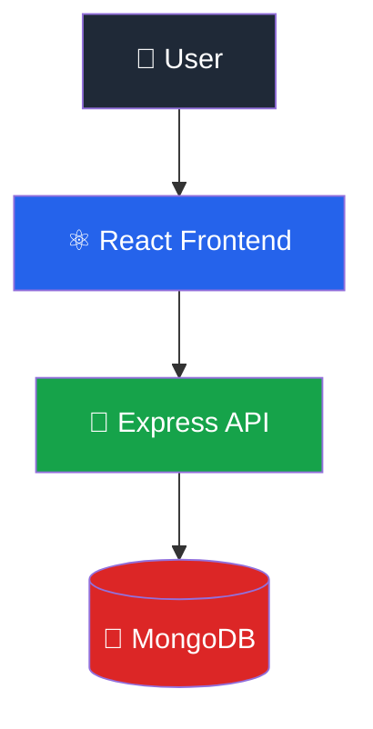
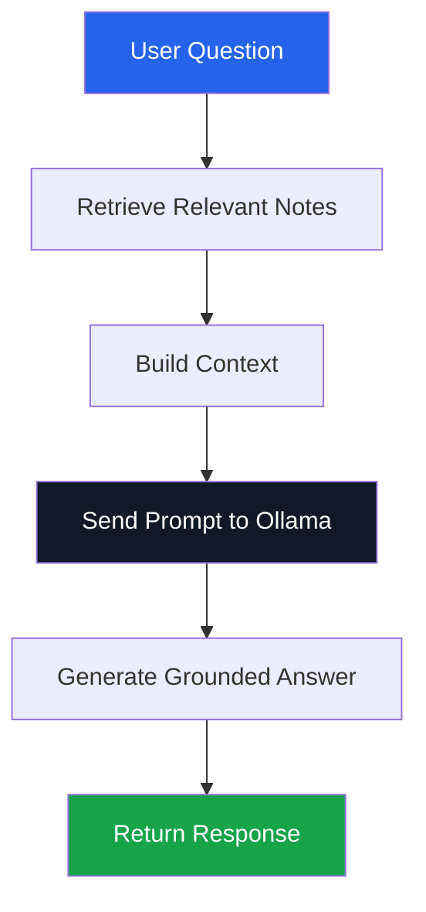
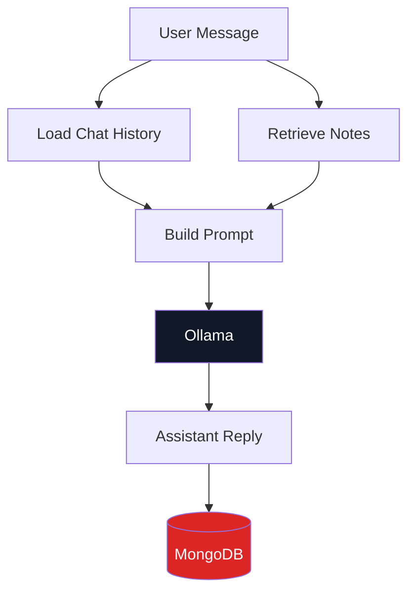

# Second Brain

A personal knowledge assistant that helps you save notes, search them quickly, and ask AI questions grounded in your own content.

## What this project does

Second Brain is designed to solve the problem of scattered personal knowledge. Instead of keeping ideas, references, and reminders across multiple apps, this project gives you one place to:

- create and manage notes
- search notes by keyword
- filter notes by tag
- ask AI questions based on your saved notes
- keep simple chat history for follow-up questions

This is a lightweight RAG-style app, where the AI answers are grounded in your own notes instead of relying only on general model knowledge.

## How it works

### Notes
Notes are stored in MongoDB and can be:

- created
- listed
- searched
- filtered by tag
- deleted

### AI answers
When you ask a question:

1. the backend finds relevant notes
2. the notes are converted into plain text context
3. the context is sent to Ollama
4. Ollama generates a response based on that context

### Chat memory
The app also supports simple chat sessions:

- a new chat can be created
- messages are stored in MongoDB
- previous messages are included in follow-up responses

## Tech stack

## Backend


## Frontend


## Features

- Note CRUD
- Search notes
- Filter notes by tag
- AI question answering from note context
- Retrieval test endpoint
- Chat sessions with persisted history
- Clean, responsive UI

## Project structure

```txt
SecondBrain/
├── backend/
│   ├── controllers/
│   ├── models/
│   ├── routes/
│   ├── services/
│   ├── seed.js
│   └── server.js
└── frontend/
    └── secondbrain/
        ├── src/
        │   ├── components/
        │   ├── pages/
        │   ├── services/
        │   ├── App.jsx
        │   ├── App.css
        │   └── index.css
        └── package.json
```

## Requirements

Before running the project, make sure you have:

- Node.js installed
- MongoDB running locally or a MongoDB Atlas connection string
- Ollama running locally

## Environment variables

### Backend

Create a `.env` file inside `backend/`:

```env
PORT=3000
MONGODB_URI=your_mongodb_connection_string
OPENROUTER_API_KEY=your_openrouter_api_key
OPENROUTER_MODEL=meta-llama/llama-3.2-3b-instruct:free
OPENROUTER_SITE_URL=http://localhost:3000
OPENROUTER_APP_NAME=SecondBrain
JWT_SECRET=your_secret_here
```

### Frontend

Create a `.env` file inside `frontend/secondbrain/`:

```env
VITE_API_BASE_URL=http://localhost:3000
```

For production, set:

```env
VITE_API_BASE_URL=https://secondbrain-pi02.onrender.com
```

## Setup

### Backend

```bash
cd backend
npm install
npm run dev
```

### Frontend

```bash
cd frontend/secondbrain
npm install
npm run dev
```

## How to test the backend

### 1. Test note creation
Use Postman or the frontend to create a note.

Example:

```http
POST /notes
```

Body:

```json
{
  "title": "Credit Cards",
  "content": "Credit cards let you borrow money from a bank.",
  "tags": ["finance"]
}
```

### 2. Test note search
Fetch notes with keyword or tag filters:

```http
GET /notes?q=react
GET /notes?tag=frontend
```

### 3. Test retrieval only
Use the retrieval test endpoint:

```http
POST /api/ai/test-retrieval
```

Body:

```json
{
  "question": "What is React?"
}
```

Expected:
- relevant notes returned
- or a clear message saying no relevant notes were found

### 4. Test AI answers
Ask a grounded question:

```http
POST /api/ai/ask
```

Body:

```json
{
  "question": "What is React?"
}
```

Expected:
- an answer generated from matching notes
- if nothing relevant exists, the assistant should say it could not find the information in your notes

### 5. Test chat
Create a new conversation:

```http
POST /api/chat/new
```

Load a chat:

```http
GET /api/chat/:chatId
```

Send a message:

```http
POST /api/chat/:chatId
```

Body:

```json
{
  "message": "What is React?"
}
```

## How to test the frontend

Open the frontend in the browser and verify:

- notes load from the backend
- note creation works
- note deletion works
- search works
- tag filtering works
- AI/chat page loads and keeps conversation history

## Current architecture

### Notes flow



### AI flow



### Chat flow
## 💬 Chat Flow



## Deployment

### Frontend (Vercel)
- **Link**: https://secondbrain-frontend-eight.vercel.app
- **Build Command**: `npm run build`
- **Output Directory**: `dist`
- **Root Directory**: `frontend/secondbrain`
- **Environment Variables**: `VITE_API_BASE_URL=https://secondbrain-pi02.onrender.com`

### Backend (Render)
- **Link**: https://secondbrain-pi02.onrender.com
- **Build Command**: (leave empty)
- **Start Command**: `npm start`
- **Root Directory**: `backend`
- **Environment Variables**: 
  - `MONGODB_URI`
  - `OPENROUTER_API_KEY`
  - `OPENROUTER_MODEL`
  - `OPENROUTER_SITE_URL`
  - `OPENROUTER_APP_NAME`
  - `JWT_SECRET`
  - `PORT=3000`

## Future plans

This project is meant to evolve in phases.

### Near-term improvements
- better semantic retrieval with embeddings
- more accurate keyword matching
- edit note functionality
- note categories or folders
- richer chat history management
- streaming AI responses
- toast notifications and loading skeletons

### Longer-term direction
- authentication and user accounts
- semantic search instead of only keyword search
- note summarization
- multi-user support
- mobile-first UX polish
- deployment-ready configuration

## Why this project matters

Second Brain turns personal notes into an intelligent knowledge base.

It helps you:
- organize ideas
- find information faster
- ask questions in plain language
- get answers based on your own knowledge

## License

