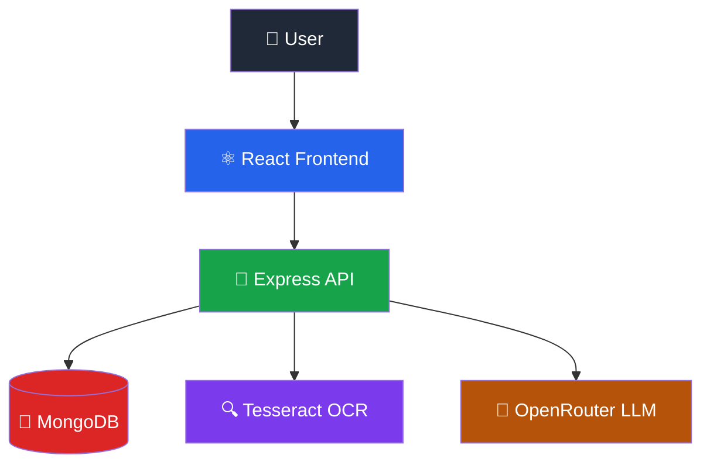
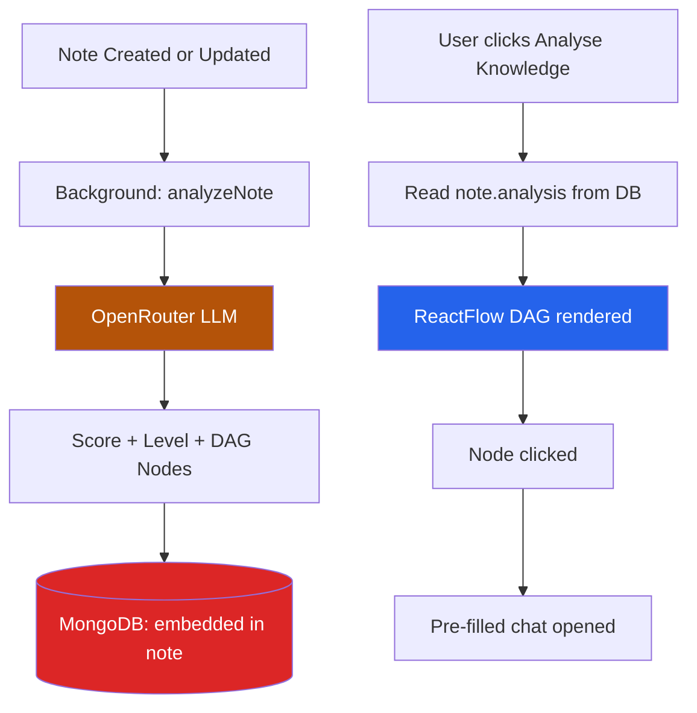
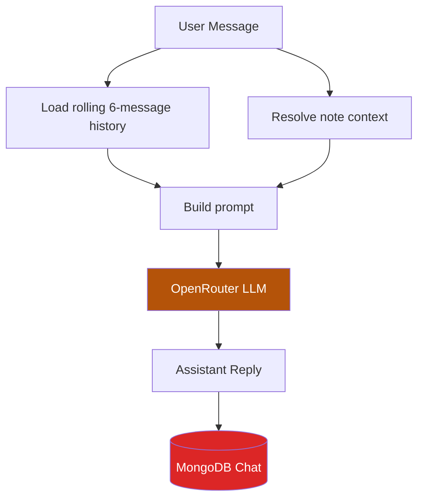

# Second Brain

An intelligent personal knowledge assistant that helps you capture notes, extract text from images, and use AI to understand and deepen your learning — all grounded in your own content.

## Live Demo

- **Frontend**: https://secondbrain-frontend-eight.vercel.app
- **Backend API**: https://secondbrain-pi02.onrender.com

## What this project does

Second Brain turns personal notes into an adaptive learning workspace. Instead of passively storing information, it actively analyses your knowledge, maps where you stand, and guides you toward what to learn next.

- Create and manage text notes (markdown supported) or image notes with OCR
- Search notes by keyword, filter by tag
- Use AI to convert or improve note content
- Get a knowledge analysis score and interactive learning roadmap per note
- Chat with an AI tutor grounded in your own notes
- Per-note chat history with a persistent sidebar

## How it works

### Notes

Notes are stored in MongoDB and can be:

- created as text or uploaded as images (OCR extracts the text automatically)
- searched by keyword across title, content, OCR text, and tags
- filtered by tag
- edited via AI draft (convert format or improve with AI)
- deleted (also removes linked chat history)

### AI / LLM integration

All LLM calls go through **OpenRouter** (`https://openrouter.ai/api/v1/chat/completions`).

- Primary model: `meta-llama/llama-3.2-3b-instruct:free` (configurable via env)
- Automatic fallback chain across multiple free models on 404/429 errors
- Temperature: 0.2 — kept low for consistent, grounded answers

### Knowledge Analysis

When a note is created or updated, an analysis runs in the background (non-blocking):

1. The LLM assesses knowledge depth and returns a score (0–100), level (beginner → expert), summary, strengths, and gaps
2. A DAG flowchart of 5–8 topic nodes is generated, from beginner → intermediate → advanced, with the current level marked
3. The result is embedded directly in the note document in MongoDB
4. The frontend renders this as an interactive **ReactFlow** diagram — clicking any node opens a targeted chat explanation

### Learning Diagnosis Engine

A cross-note analysis endpoint (`POST /api/ai/learning-diagnosis`) takes a list of tags, fetches all matching notes, and returns:

- Covered topics (with depth, confidence, and evidence)
- Gaps with importance ratings
- Prerequisite chains showing how topics depend on each other
- A phased learning roadmap with suggested durations
- Actionable next steps and recommendations

### Chat system

Each note gets its own persistent chat session stored in MongoDB:

- Rolling 6-message history included in every LLM request for context
- If a `noteId` is provided, that note's content is used as context
- Otherwise, keyword retrieval finds the top 3 relevant notes to ground the answer
- The chat sidebar persists note-to-chat mappings in `localStorage`
- AI responses are rendered with full markdown (headings, bullets, code blocks, tables)

### Keyword retrieval (RAG)

When answering questions:

1. Stop-word filtered keywords are extracted from the question
2. Regex search across `title`, `content`, `ocrText`, and `tags` in MongoDB
3. Relevance scored: title/tags = 3pts, content/ocrText = 2pts per keyword hit
4. Top 3 notes sent as context to the LLM

## Tech stack

### Backend


### Frontend


## Features

- Note CRUD (text and image)
- OCR text extraction from uploaded images (Tesseract.js)
- Keyword search and tag filtering
- AI note actions: convert format, improve with AI
- Per-note knowledge analysis: score, level badge, strengths, gaps
- Interactive learning roadmap flowchart (ReactFlow DAG)
- Learning diagnosis engine: cross-note analysis by tag
- Per-note chat sessions with persistent history
- Chat sidebar showing all note conversations
- Grounded AI answers from your own notes
- Markdown rendering in notes and chat responses
- Responsive dark UI

## Project structure

```txt
SecondBrain/
├── backend/
│   ├── controllers/
│   │   ├── aiController.js       # askQuestion, noteAction, getLearningDiagnosis
│   │   ├── chatController.js     # createChat, getChat, sendMessage
│   │   └── noteController.js     # CRUD, image upload, reAnalyzeNote
│   ├── middleware/
│   │   └── upload.js             # multer config (disk storage, 10MB limit)
│   ├── models/
│   │   ├── Chat.js               # Chat schema: noteId ref, messages[]
│   │   └── Note.js               # Note schema: content, OCR fields, embedded analysis + DAG nodes
│   ├── routes/
│   │   ├── aiRoute.js
│   │   ├── chatRoutes.js
│   │   └── noteRoutes.js
│   ├── services/
│   │   ├── aiService.js          # OpenRouter client with model fallback chain
│   │   ├── analysisService.js    # analyzeNote (per-note), analyzeLearningPath (cross-note)
│   │   ├── ocrService.js         # Tesseract.js wrapper
│   │   └── retrievalService.js   # Keyword extraction + scored note retrieval
│   ├── uploads/                  # Served as static files at /uploads
│   └── server.js
│
└── frontend/secondbrain/
    └── src/
        ├── components/
        │   ├── AddNote.jsx           # Create note modal (text or image)
        │   ├── KnowledgeAnalysis.jsx # ReactFlow DAG + score ring + strengths/gaps
        │   ├── NoteCard.jsx          # Grid card with tone colors and preview
        │   ├── NoteDetail.jsx        # Detail modal: markdown view + AI action buttons
        │   ├── SearchBar.jsx
        │   └── TagFilter.jsx
        ├── pages/
        │   ├── ChatPage.jsx          # Chat UI with sidebar, markdown responses
        │   └── Home.jsx              # Notes grid, orchestrates all modals
        ├── services/
        │   └── api.js                # Fetch wrappers for all backend endpoints
        └── App.jsx                   # Top-level nav (Notes / Chat), topic chat bridge
```

## API routes

### Notes `/notes`

```
POST   /notes              Create text note (title, content, tags)
POST   /notes/upload       Create image note (multipart/form-data, image field)
GET    /notes              List notes — ?q=keyword&tag=filter
GET    /notes/:id          Get single note
PUT    /notes/:id          Update note
DELETE /notes/:id          Delete note (also deletes linked chats)
```

### AI `/api/ai`

```
POST   /api/ai/ask                  RAG Q&A grounded in your notes
POST   /api/ai/test-retrieval       Debug: show which notes are retrieved for a query
POST   /api/ai/note-action          AI draft: body { noteId, mode: "convert" | "improve" }
POST   /api/ai/analyze/:id          Re-run knowledge analysis for a note
POST   /api/ai/learning-diagnosis   Cross-note diagnosis: body { tags: string[] }
```

### Chat `/api/chat`

```
POST   /api/chat/new        Create a new chat session — body { noteId? }
GET    /api/chat/:chatId    Load a chat with its message history
POST   /api/chat/:chatId    Send a message — body { message, noteId? }
```

## Requirements

Before running locally, make sure you have:

- Node.js installed
- A MongoDB Atlas connection string (or local MongoDB)
- An OpenRouter API key (free tier works — https://openrouter.ai)

## Environment variables

### Backend

Create a `.env` file inside `backend/`:

```env
PORT=3000
MONGODB_URI=your_mongodb_connection_string
OPENROUTER_API_KEY=your_openrouter_api_key
OPENROUTER_MODEL=meta-llama/llama-3.2-3b-instruct:free
OPENROUTER_SITE_URL=http://localhost:3000
OPENROUTER_APP_NAME=SecondBrain
JWT_SECRET=your_secret_here
```

### Frontend

Create a `.env` file inside `frontend/secondbrain/`:

```env
VITE_API_BASE_URL=http://localhost:3000
```

For production, set:

```env
VITE_API_BASE_URL=https://secondbrain-pi02.onrender.com
```

## Setup

### Backend

```bash
cd backend
npm install
npm run dev
```

### Frontend

```bash
cd frontend/secondbrain
npm install
npm run dev
```

## Deployment

### Frontend (Vercel)

- **Link**: https://secondbrain-frontend-eight.vercel.app
- **Root Directory**: `frontend/secondbrain`
- **Build Command**: `npm run build`
- **Output Directory**: `dist`
- **Environment Variables**: `VITE_API_BASE_URL=https://secondbrain-pi02.onrender.com`

### Backend (Render)

- **Link**: https://secondbrain-pi02.onrender.com
- **Root Directory**: `backend`
- **Build Command**: *(leave empty)*
- **Start Command**: `npm start`
- **Environment Variables**: `MONGODB_URI`, `OPENROUTER_API_KEY`, `OPENROUTER_MODEL`, `OPENROUTER_SITE_URL`, `OPENROUTER_APP_NAME`, `PORT`

## How to test the backend

### Create a note

```http
POST /notes
```

```json
{
  "title": "Operating Systems",
  "content": "A process is a program in execution. Threads share memory space within a process.",
  "tags": ["cs", "os"]
}
```

### Search notes

```http
GET /notes?q=process
GET /notes?tag=os
```

### Test retrieval

```http
POST /api/ai/test-retrieval
```

```json
{
  "question": "What is a thread?"
}
```

### Ask a grounded question

```http
POST /api/ai/ask
```

```json
{
  "question": "What is the difference between a process and a thread?"
}
```

### Run knowledge analysis

```http
POST /api/ai/analyze/:noteId
```

### Learning diagnosis across notes

```http
POST /api/ai/learning-diagnosis
```

```json
{
  "tags": ["os", "cs"]
}
```

### Chat about a note

```http
POST /api/chat/new
```

```json
{ "noteId": "<note_id>" }
```

```http
POST /api/chat/:chatId
```

```json
{
  "message": "Explain deadlocks to me",
  "noteId": "<note_id>"
}
```

## How to test the frontend

Open the frontend in the browser and verify:

- notes load from the backend
- note creation works (text and image)
- OCR text appears for image notes
- note deletion works
- search and tag filtering work
- clicking a note opens the detail modal
- "Analyse Knowledge" shows score, level badge, and flowchart
- clicking a flowchart node opens a pre-filled chat
- chat sidebar shows per-note conversations
- AI responses render with proper markdown formatting

## Current architecture

### Notes flow



### AI / Analysis flow



### Chat flow



## Future plans

### Near-term improvements

- Streaming AI responses for faster perceived performance
- Embeddings-based semantic retrieval to replace keyword matching
- Edit note title and tags in-place without AI
- Toast notifications and loading skeletons
- Mobile-first UX polish

### Longer-term direction

- Authentication and user accounts
- Note folders and categories
- Multi-user support
- Export notes (PDF, markdown file)
- Full learning diagnosis UI surfaced in the frontend

## Why this project matters

Second Brain turns personal notes into an intelligent knowledge base.

It helps you:

- organize and retrieve ideas quickly
- understand where your knowledge stands relative to a full topic map
- get targeted AI explanations grounded in what you already know
- build a guided learning path from your own notes outward

## License


